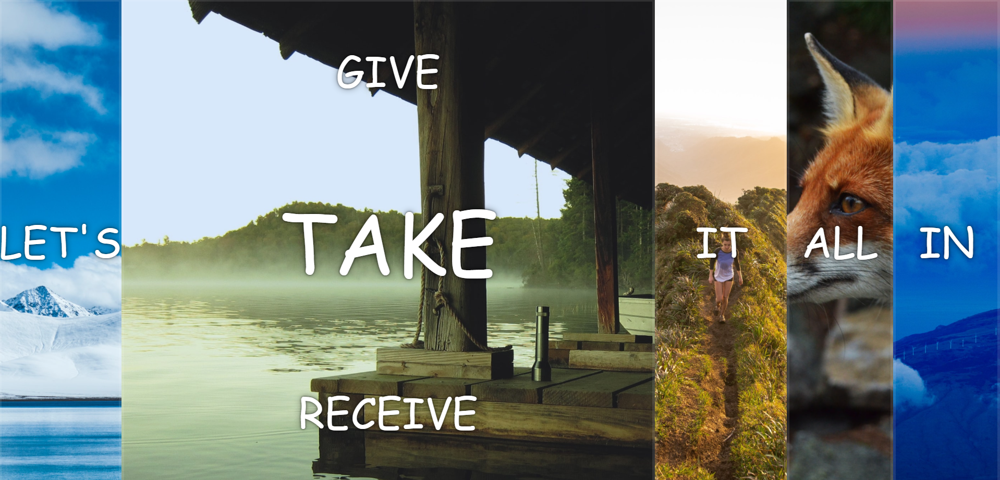

# 30 Day Vanilla JavaScript

I am doing this challenge to brush up on my JavaScript Skils now that I am going to start learning React.

## Day 1

Consisted of making a sound board using vanilla javascript. I wanted to make it my own so I
went with a different sound board and background than was in the original video. I learned about key events, how to play audio, and how to work with transitions. My sound
board contains different anime sounds and looks like this:


## Day 2
Consisted of making a clock using vanilla javascript. I learned about transform in CSS and more about transitions. I was able to remove and add a class to make the clock run more smoothly using what I learned yesterday.


## Day 3
In Day 3 I had to work with CSS variables for the first time, it was interested feature  I did not know existed. I had a bit of trouble with the tutorial because the code that was being used was not working for me so I had to figure out a different way to access the datasets. Instead of using 
this.dataset I passed a parameter e into my function and used e.target.dataset to access the datasets in my HTML file. 


## Day 4

In day 4 I had to work with array methods, this was a bit a refresher but I will for sure be practicing these more because I know they are important when learning react so I really want to get these down. I personally find reduce the most confusing at times but I am pretty comfortable with the other methods like sort, filter, and map.

## Day 5 
I got to work with flex-box which was a great refresher. Flex-box can be confusing at times but it is super helpful in the making of websites, it's a great way to make sure things stay aligned and are in the right place. It's my go to when I have a bunch of items and want to make sure they appear it the correct direction. I also used some more transform/transitions to make a more interactive design. To practice what I have learned I am going to try to incorporate transitions into my personal website to add some interactivity and animations.



## Day 6
Today was super fun, I got to use the fetch method to retrieve data for search functionality. The data fetched was from a github that had a huge array of cities, states, population amount, and more. I also was able to use regex a bit which I have used in the past but this is the first time I use "gi" g standing for global so it searches all the information and i for insensitive so it uses both uppercase and lowercase. I learned that Fetch retrieves a promise not the actual data so I had to make sure that I added code to make sure the data was properly retrieved and came up on the site by using the then() method which is used to deal with tasks such as API calls.
```
fetch(endpoint)
    .then(rawData => rawData.json())
    .then(data => cities.push(...data));
```


## Day 7
Day 7 was another day for array methods! I got to use array methods I have never used before like some() and every(). I thought it would be difficult because I had never seen them before with some quick help from MDN I was able to complete all the tasks and get the correct answers. 

## Day 8
Today I worked with HTML5 canvas! It's something I have been wanted to do for a while but never got around to it, I learned a lot about canvas and how to build a very basic drawing board. In the future I want to expand on this and make a full site where users can choose colors, sizes, and stickers. Since I am learning react now I will most likely incorporate it into a react project for further practice.

